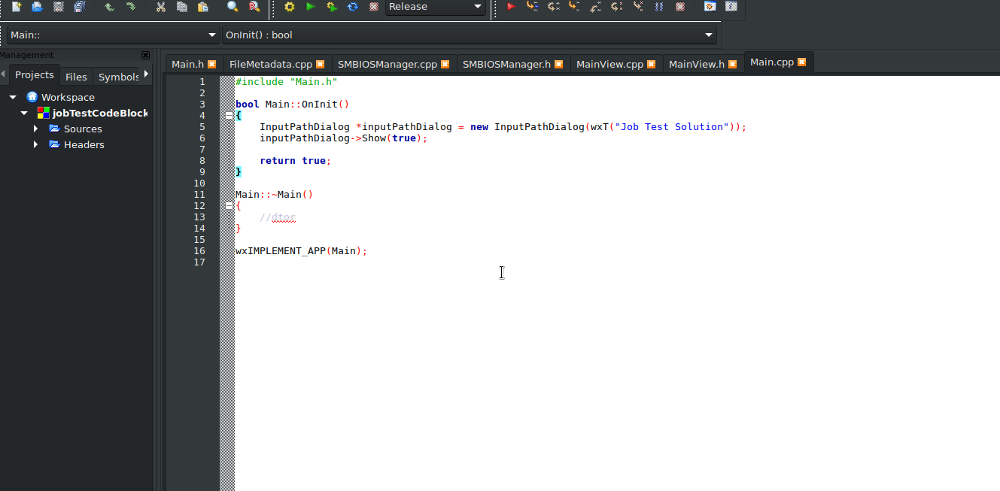

# gccJobTest


Algunos elementos se tuvieron que borrar debido a la gran cantidad de espacio que ocupan individualmente, pero hasta donde yo tenía el sistema no es necesario su uso principalmente con wxWidgets y boost.

Este proyecto fue compilado en debian 9 usando gcc para compilar tanto c como c++ en el estandar c++11.

```
$ gcc --version
gcc (Debian 6.3.0-18+deb9u1) 6.3.0 20170516
Copyright (C) 2016 Free Software Foundation, Inc.
```

## Desempaquetado de la app:

Debido a la falta de tiempo y por compilación estática, es necesario que se desempaquete el sistema en la ruta "/home/jjalvarezl/Proyectos/jobTestCodeBlocks"

## Si es necesario compilar sus dependencias:

* wxWidgets:
  * en wxWidgets-3.0.4 ejecutar configure: $ ./configure --disable-shared --enable-unicode --enable-static
  * luejo ejecutar make: "$ make"
* sqlite3:
  * en el directorio sqlite3 ejecutar: $ ./configure  --enable-static
  * luejo ejecutar make: "$ make"
* zlib:
  * los mismos pasos que sqlite3 pero en el directorio zlib-1.2.11
  * ir a la carpeta zlib-1.2.11/contrib/minizip y ejecutar "$ make"
* boost:
  * ir a la carpeta boost_1_66_0 y ejecutar: "$ ./boostrap.sh && ./b2 link=static"

## Compilado:

* Lastimosamente no pude realizar el compilado estático de todo el sistema (es solo añadir la bandera "-static" a la compilación), sin embargo, puede tener 2 opciones:

  1. Descargar codeblocks y abrir directamente el proyecto que ya contiene las banderas, ó:
  2. ejecutar las siguientes sentencias en el directorio raíz del proyecto (si quiere intentar compilarlo estaticamente que no es mucho tiempo por favor añadir la bandera "-static" en la última sentencia de compilación):

```

gcc -Wall -std=c++11 -fexceptions -std=c++11 -g -I/home/jjalvarezl/Proyectos/jobTestCodeBlocks/wxWidgets-3.0.4/lib/wx/include/gtk2-unicode-static-3.0 -I/home/jjalvarezl/Proyectos/jobTestCodeBlocks/wxWidgets-3.0.4/include -D_FILE_OFFSET_BITS=64 -D__WXGTK__ -pthread -std=c++11 -IwxWidgets-3.0.4/include -lwxWidgets-3.0.4/lib -IwxWidgets-3.0.4/lib/wx/include/gtk2-unicode-3.0 -Izlib-1.2.11/ -Izlib-1.2.11/contrib/minizip/ -Iboost_1_66_0 -lsqlite3 -Iinclude -c /home/jjalvarezl/Proyectos/jobTestCodeBlocks/Main.cpp -o obj/Debug/Main.o

gcc -Wall -std=c++11 -fexceptions -std=c++11 -g -I/home/jjalvarezl/Proyectos/jobTestCodeBlocks/wxWidgets-3.0.4/lib/wx/include/gtk2-unicode-static-3.0 -I/home/jjalvarezl/Proyectos/jobTestCodeBlocks/wxWidgets-3.0.4/include -D_FILE_OFFSET_BITS=64 -D__WXGTK__ -pthread -std=c++11 -IwxWidgets-3.0.4/include -lwxWidgets-3.0.4/lib -IwxWidgets-3.0.4/lib/wx/include/gtk2-unicode-3.0 -Izlib-1.2.11/ -Izlib-1.2.11/contrib/minizip/ -Iboost_1_66_0 -lsqlite3 -Iinclude -c /home/jjalvarezl/Proyectos/jobTestCodeBlocks/src/FileMetadata.cpp -o obj/Debug/src/FileMetadata.o

gcc -Wall -std=c++11 -fexceptions -std=c++11 -g -I/home/jjalvarezl/Proyectos/jobTestCodeBlocks/wxWidgets-3.0.4/lib/wx/include/gtk2-unicode-static-3.0 -I/home/jjalvarezl/Proyectos/jobTestCodeBlocks/wxWidgets-3.0.4/include -D_FILE_OFFSET_BITS=64 -D__WXGTK__ -pthread -std=c++11 -IwxWidgets-3.0.4/include -lwxWidgets-3.0.4/lib -IwxWidgets-3.0.4/lib/wx/include/gtk2-unicode-3.0 -Izlib-1.2.11/ -Izlib-1.2.11/contrib/minizip/ -Iboost_1_66_0 -lsqlite3 -Iinclude -c /home/jjalvarezl/Proyectos/jobTestCodeBlocks/src/InputPathDialog.cpp -o obj/Debug/src/InputPathDialog.o

gcc -Wall -std=c++11 -fexceptions -std=c++11 -g -I/home/jjalvarezl/Proyectos/jobTestCodeBlocks/wxWidgets-3.0.4/lib/wx/include/gtk2-unicode-static-3.0 -I/home/jjalvarezl/Proyectos/jobTestCodeBlocks/wxWidgets-3.0.4/include -D_FILE_OFFSET_BITS=64 -D__WXGTK__ -pthread -std=c++11 -IwxWidgets-3.0.4/include -lwxWidgets-3.0.4/lib -IwxWidgets-3.0.4/lib/wx/include/gtk2-unicode-3.0 -Izlib-1.2.11/ -Izlib-1.2.11/contrib/minizip/ -Iboost_1_66_0 -lsqlite3 -Iinclude -c /home/jjalvarezl/Proyectos/jobTestCodeBlocks/src/LogLineMetadata.cpp -o obj/Debug/src/LogLineMetadata.o

gcc -Wall -std=c++11 -fexceptions -std=c++11 -g -I/home/jjalvarezl/Proyectos/jobTestCodeBlocks/wxWidgets-3.0.4/lib/wx/include/gtk2-unicode-static-3.0 -I/home/jjalvarezl/Proyectos/jobTestCodeBlocks/wxWidgets-3.0.4/include -D_FILE_OFFSET_BITS=64 -D__WXGTK__ -pthread -std=c++11 -IwxWidgets-3.0.4/include -lwxWidgets-3.0.4/lib -IwxWidgets-3.0.4/lib/wx/include/gtk2-unicode-3.0 -Izlib-1.2.11/ -Izlib-1.2.11/contrib/minizip/ -Iboost_1_66_0 -lsqlite3 -Iinclude -c /home/jjalvarezl/Proyectos/jobTestCodeBlocks/src/LogMetadata.cpp -o obj/Debug/src/LogMetadata.o

gcc -Wall -std=c++11 -fexceptions -std=c++11 -g -I/home/jjalvarezl/Proyectos/jobTestCodeBlocks/wxWidgets-3.0.4/lib/wx/include/gtk2-unicode-static-3.0 -I/home/jjalvarezl/Proyectos/jobTestCodeBlocks/wxWidgets-3.0.4/include -D_FILE_OFFSET_BITS=64 -D__WXGTK__ -pthread -std=c++11 -IwxWidgets-3.0.4/include -lwxWidgets-3.0.4/lib -IwxWidgets-3.0.4/lib/wx/include/gtk2-unicode-3.0 -Izlib-1.2.11/ -Izlib-1.2.11/contrib/minizip/ -Iboost_1_66_0 -lsqlite3 -Iinclude -c /home/jjalvarezl/Proyectos/jobTestCodeBlocks/src/MainView.cpp -o obj/Debug/src/MainView.o

gcc -Wall -std=c++11 -fexceptions -std=c++11 -g -I/home/jjalvarezl/Proyectos/jobTestCodeBlocks/wxWidgets-3.0.4/lib/wx/include/gtk2-unicode-static-3.0 -I/home/jjalvarezl/Proyectos/jobTestCodeBlocks/wxWidgets-3.0.4/include -D_FILE_OFFSET_BITS=64 -D__WXGTK__ -pthread -std=c++11 -IwxWidgets-3.0.4/include -lwxWidgets-3.0.4/lib -IwxWidgets-3.0.4/lib/wx/include/gtk2-unicode-3.0 -Izlib-1.2.11/ -Izlib-1.2.11/contrib/minizip/ -Iboost_1_66_0 -lsqlite3 -Iinclude -c /home/jjalvarezl/Proyectos/jobTestCodeBlocks/src/SMBIOSManager.cpp -o obj/Debug/src/SMBIOSManager.o

gcc -Wall -std=c++11 -fexceptions -std=c++11 -g -I/home/jjalvarezl/Proyectos/jobTestCodeBlocks/wxWidgets-3.0.4/lib/wx/include/gtk2-unicode-static-3.0 -I/home/jjalvarezl/Proyectos/jobTestCodeBlocks/wxWidgets-3.0.4/include -D_FILE_OFFSET_BITS=64 -D__WXGTK__ -pthread -std=c++11 -IwxWidgets-3.0.4/include -lwxWidgets-3.0.4/lib -IwxWidgets-3.0.4/lib/wx/include/gtk2-unicode-3.0 -Izlib-1.2.11/ -Izlib-1.2.11/contrib/minizip/ -Iboost_1_66_0 -lsqlite3 -Iinclude -c /home/jjalvarezl/Proyectos/jobTestCodeBlocks/src/SqliteDBAnalysis.cpp -o obj/Debug/src/SqliteDBAnalysis.o

gcc -Wall -std=c++11 -fexceptions -std=c++11 -g -I/home/jjalvarezl/Proyectos/jobTestCodeBlocks/wxWidgets-3.0.4/lib/wx/include/gtk2-unicode-static-3.0 -I/home/jjalvarezl/Proyectos/jobTestCodeBlocks/wxWidgets-3.0.4/include -D_FILE_OFFSET_BITS=64 -D__WXGTK__ -pthread -std=c++11 -IwxWidgets-3.0.4/include -lwxWidgets-3.0.4/lib -IwxWidgets-3.0.4/lib/wx/include/gtk2-unicode-3.0 -Izlib-1.2.11/ -Izlib-1.2.11/contrib/minizip/ -Iboost_1_66_0 -lsqlite3 -Iinclude -c /home/jjalvarezl/Proyectos/jobTestCodeBlocks/src/SqliteManagement.cpp -o obj/Debug/src/SqliteManagement.o

gcc -Wall -std=c++11 -fexceptions -std=c++11 -g -I/home/jjalvarezl/Proyectos/jobTestCodeBlocks/wxWidgets-3.0.4/lib/wx/include/gtk2-unicode-static-3.0 -I/home/jjalvarezl/Proyectos/jobTestCodeBlocks/wxWidgets-3.0.4/include -D_FILE_OFFSET_BITS=64 -D__WXGTK__ -pthread -std=c++11 -IwxWidgets-3.0.4/include -lwxWidgets-3.0.4/lib -IwxWidgets-3.0.4/lib/wx/include/gtk2-unicode-3.0 -Izlib-1.2.11/ -Izlib-1.2.11/contrib/minizip/ -Iboost_1_66_0 -lsqlite3 -Iinclude -c /home/jjalvarezl/Proyectos/jobTestCodeBlocks/src/ZlibManagement.cpp -o obj/Debug/src/ZlibManagement.o

g++  -o bin/Debug/jobTestCodeBlocks obj/Debug/Main.o obj/Debug/src/FileMetadata.o obj/Debug/src/InputPathDialog.o obj/Debug/src/LogLineMetadata.o obj/Debug/src/LogMetadata.o obj/Debug/src/MainView.o obj/Debug/src/SMBIOSManager.o obj/Debug/src/SqliteDBAnalysis.o obj/Debug/src/SqliteManagement.o obj/Debug/src/ZlibManagement.o  -L/home/jjalvarezl/Proyectos/jobTestCodeBlocks/wxWidgets-3.0.4/lib -pthread   /home/jjalvarezl/Proyectos/jobTestCodeBlocks/wxWidgets-3.0.4/lib/libwx_gtk2u_xrc-3.0.a /home/jjalvarezl/Proyectos/jobTestCodeBlocks/wxWidgets-3.0.4/lib/libwx_gtk2u_qa-3.0.a /home/jjalvarezl/Proyectos/jobTestCodeBlocks/wxWidgets-3.0.4/lib/libwx_baseu_net-3.0.a /home/jjalvarezl/Proyectos/jobTestCodeBlocks/wxWidgets-3.0.4/lib/libwx_gtk2u_html-3.0.a /home/jjalvarezl/Proyectos/jobTestCodeBlocks/wxWidgets-3.0.4/lib/libwx_gtk2u_adv-3.0.a /home/jjalvarezl/Proyectos/jobTestCodeBlocks/wxWidgets-3.0.4/lib/libwx_gtk2u_core-3.0.a /home/jjalvarezl/Proyectos/jobTestCodeBlocks/wxWidgets-3.0.4/lib/libwx_baseu_xml-3.0.a /home/jjalvarezl/Proyectos/jobTestCodeBlocks/wxWidgets-3.0.4/lib/libwx_baseu-3.0.a -lgthread-2.0 -pthread -lX11 -lXxf86vm -lSM -lgtk-x11-2.0 -lgdk-x11-2.0 -lpangocairo-1.0 -latk-1.0 -lcairo -lgdk_pixbuf-2.0 -lgio-2.0 -lpangoft2-1.0 -lpango-1.0 -lgobject-2.0 -lglib-2.0 -lfontconfig -lfreetype -lpng -ljpeg -lexpat -lwxregexu-3.0 -lwxtiff-3.0 -lz -ldl -lm  -lz -lboost_filesystem -lboost_system -ldl  zlib-1.2.11/libz.a zlib-1.2.11/contrib/minizip/ioapi.o zlib-1.2.11/contrib/minizip/unzip.o zlib-1.2.11/contrib/minizip/zip.o sqlite3/.libs/libsqlite3.a

```

Dependencias adicionales que necesita el compilado estatico de wxWidgets (instalandolo desde apt):

-lgthread-2.0
-pthread
-lX11
-lXxf86vm
-lSM
-lgtk-x11-2.0
-lgdk-x11-2.0
-lpangocairo-1.0
-latk-1.0
-lcairo
-lgdk_pixbuf-2.0
-lgio-2.0
-lpangoft2-1.0
-lpango-1.0
-lgobject-2.0
-lglib-2.0
-lfontconfig
-lfreetype
-lpng
-ljpeg
-lexpat
-lwxregexu-3.0
-lwxtiff-3.0

## Banderas usadas en la compilación:

### Linkeo de directorios usados:

```
-IwxWidgets-3.0.4/include
-lwxWidgets-3.0.4/lib
-IwxWidgets-3.0.4/lib/wx/include/gtk2-unicode-3.0
-Izlib-1.2.11/
-Izlib-1.2.11/contrib/minizip/
-Iboost_1_66_0
-lsqlite3
```
### Opciones de ejecución:

```
-lz
-lboost_filesystem
-lboost_system
-ldl
```

### Linkeo de rutas de las librerías .a usadas:
```
zlib-1.2.11/libz.a
zlib-1.2.11/contrib/minizip/ioapi.o
zlib-1.2.11/contrib/minizip/unzip.o
zlib-1.2.11/contrib/minizip/zip.o
sqlite3/.libs/libsqlite3.a
```

### Obtención de las librerías con wx-config:
```
`./wxWidgets-3.0.4/wx-config --libs`
`./wxWidgets-3.0.4/wx-config --cxxflags`
```


## Restricciones:

* Los logs deben tener la extension .log o la extension .log.x donde x puede ser cualquier cadena *sin puntos*.
* Al no poderse impŕimir en wxWidgets, por cada archivo de log se imprime el numero de coincidencias en un archivo con el mismo nombre del archivo log en la carpeta ./logAnalisys.
* Dado a que hay dos archivos .dat para diferentes propositos dentro de la prueba, se ha dejado con nombre a Agent9.3.2.dat como nombre fijo de archivo para para procesamiento con sqlite y a smbios.dat como nombre fijo de archivo para SMBios.
* Debido a que la compilación de las librerías es estática es necesario que se ubique el proyecto en "/home/jjalvarezl/Proyectos/jobTestCodeBlocks/"

# Demostración de la aplicación

Se ilustra la aplicación corriendo con las anteriores instrucciones de compilado.


